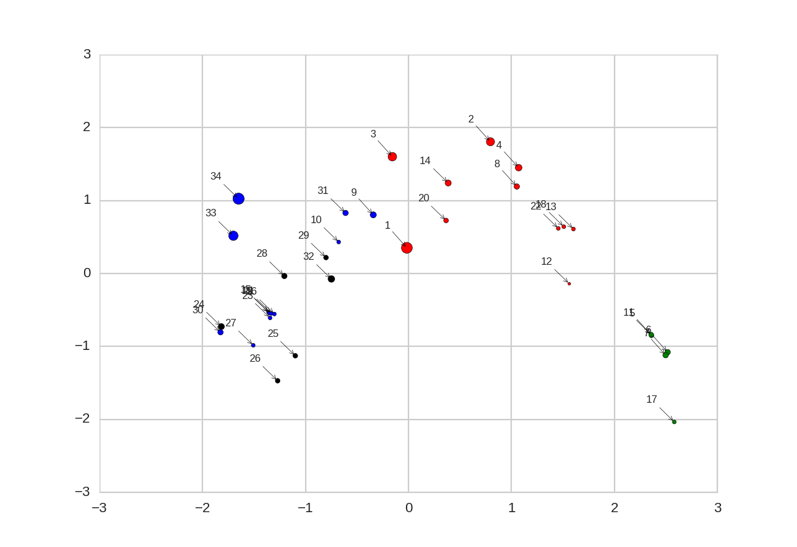

Implementation of Deepwalk algorithm
====================================

Reimplementation of deepwalk algorithm from https://github.com/phanein/deepwalk

## Requirements
 * Numpy
 * Theano
 * Keras
 * python-igraph
 * matplotlib, sklearn (for plotting)

## Zachary's Karate Graph

The following is the image of the PCA components of the vectors learned for the nodes of the graph of Zachary's Karate Graph. The communities in the graph were detected using the modularity algorithm implemented in `igraph`

